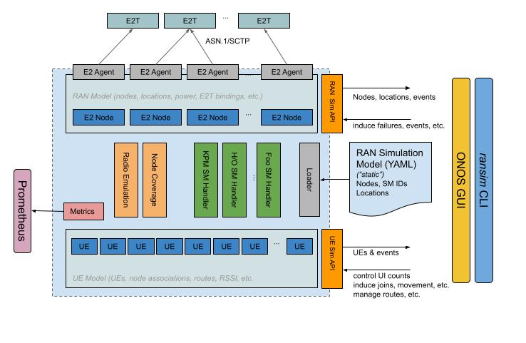

<!--
SPDX-FileCopyrightText: 2019-present Open Networking Foundation <info@opennetworking.org>

SPDX-License-Identifier: Apache-2.0
-->

# RAN Simulator

This software allows simulation of a number of RAN CU/DU nodes and RU cells via the O-RAN E2AP standard.
The simulated RAN environment is described using a YAML model file loaded at start-up.
The simulator offers a gRPC API that can be used at run-time to induce changes in order to 
simulate a dynamically changing environment.

The main RAN simulator software is accompanied by a number of utilities that allow generation of YAML files
that describe large RAN topologies and various environmental metrics, e.g. PCI.

CLI for the RAN simulator is available via `onos-cli ransim` usage and allows access to all major features of
the simulator gRPC API, for controlling and monitoring the changes to the simulated environment.

* [Quick Start](docs/quick_start.md)
* [Simulation Models and APIs](docs/model.md)
* [E2 Nodes Simulation and Service Models](docs/e2.md)
* [Honeycomb Topology Generator](docs/topology_generator.md)

## Architecture

The following figure outlines the RAN simulator architecture:

* **E2 nodes**: Upper half of the RAN simulator is responsible to simulate e2 nodes where each E2 node implements an E2 agent using E2AP, and implement service models.

* **RAN Environment**: Lower half of the RAN simulator is  responsible to simulate RAN environment to support required RAN functions
  for implementing E2 service models (e.g. simulating User Equipments (UEs), mobility, etc).

* **Data Stores**: lower half and upper half are connected using data stores that stores information
  about E2-nodes, E2-agents, UEs, RAN metrics, E2 subscriptions, etc.

* **RAN simulator APIs**: RAN simulator provides a variety of gRPC APIs that can be used for controlling E2 nodes and RAN environment.
  You can find more details about RAN simulator APIs here: [RAN simulator APIs](api.md)

* **RAN simulator CLI**: RAN simulator is equipped with a command line interface which is integrated with
  [onos-cli](https://github.com/onosproject/onos-cli) that allows to interact with RAN simulator to retrieve required information from data stores,
  monitor RAN environment changes, create/remove/update RAN entities, metrics, etc.
  The list of ransim commands is documented here [RAN simulator CLI](https://github.com/onosproject/onos-cli/blob/master/docs/cli/onos_ransim.md)
