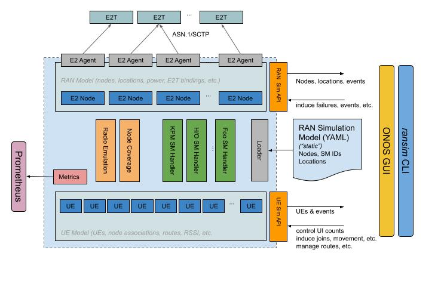

# Ransim Architecture

The Ransim application has the following key components as the following figure shows: 

* **E2 nodes**: Upper half of the Ransim is responsible to simulate e2 nodes where each E2 node implements an E2 agent using E2AP, and implement service models.

* **Ran Environment**: Lower half of the Ransim is  responsible to simulate RAN environment to support required RAN functions
  for implementing E2 service models (e.g. simulating User Equipments (UEs), mobility, etc).

* **Data Stores**: lower half and upper half are connected using data stores that stores information
about E2-nodes, E2-agents, UEs, RAN metrics, E2 subscriptions, etc. 

* **Ransim APIs**: Ransim provides a variety of gRPC APIs that can be used for controlling E2 nodes and RAN environment. 
You can find more details about Ransim APIs here: [Ransim APIs](api.md)
  
* **Ransim CLI**: Ransim is equipped with a command line interface which is integrated with 
 [onos-cli](https://github.com/onosproject/onos-cli) that allows to interact with Ransim to retrieve required information from data stores, 
  monitor RAN environment changes, create/remove/update RAN entities, metrics, etc.
  

