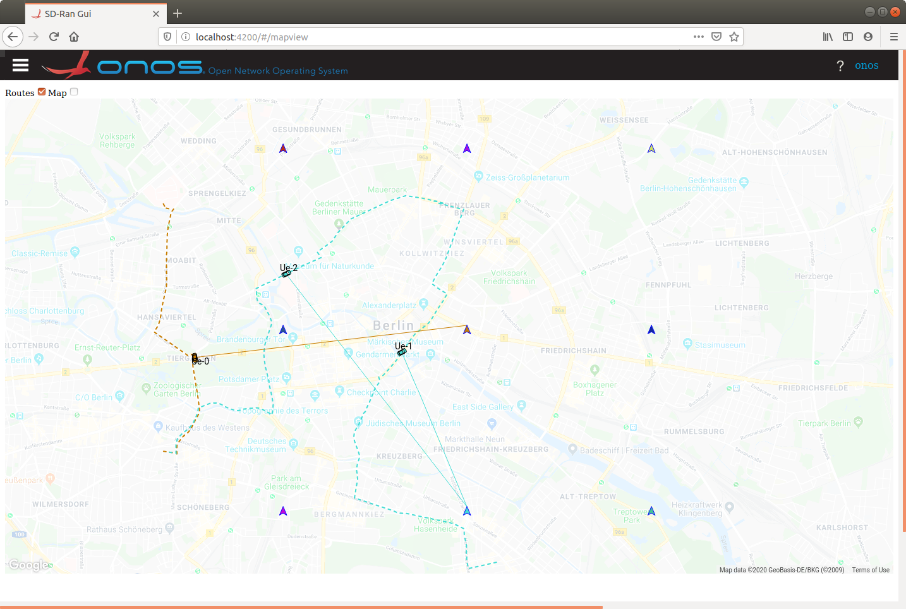

# Ran Simulator

The Ran Simulator is part of µONOS and is meant to work alongside `onos-ran` and
`sd-ran-gui`.

The simulator mimics a collection of Cell Towers and a set of UE's moving along
routes between different locations.

The application is very tunable through startup parameters, and can be run:
 
* as a standalone application in docker
* as part of a **docker-compose** collection of applications
* deployed in a **Kubernetes** cluster

## Google Maps API Key
The RAN Simulator connects to Google's [Directions API] and so needs a Google API Key.
Google charges $5.00 per 1000 requests to the [Directions API], and so we do not put
our API key up in the public domain.

The SD RAN GUI also (separately) accesses Google Maps API and also incurs a cost of $7.00 per
1000 requests. The API Key here is "baked in" to the GUI application, and so does
not need to be configured when the application is run.
> This will change in future. After the MWC demo in Feb '20 that baked in API
>Key will be made obsolete.

## Startup parameters
Supplying ran-simulator with a bogus parameter gets it to show the start parameters
and their defaults
```bash
docker run -it onosproject/ran-simulator:latest -test
...
Usage of trafficsim:
  -caPath string
    	path to CA certificate
  -certPath string
    	path to client certificate
  -fade
    	Show map as faded on start (default true)
  -googleAPIKey string
    	your google maps api key
  -keyPath string
    	path to client private key
  -mapCenterLat float
    	Map center latitude (default 52.52)
  -mapCenterLng float
    	Map center longitude (default 13.405)
  -numLocations int
    	Number of locations (default 10)
  -numRoutes int
    	Number of routes (default 3)
  -showRoutes
    	Show routes on start (default true)
  -stepDelayMs int
    	delay between steps on route (default 1000)
  -towerCols int
    	Number of columns of towers (default 3)
  -towerRows int
    	Number of rows of towers (default 3)
  -towerSpacingHoriz float
    	Tower spacing horiz in degrees longitude (default 0.02)
  -towerSpacingVert float
    	Tower spacing vert in degrees latitude (default 0.02)
  -zoom float
    	The starting Zoom level (default 12)
```

See [deployment.md] for how to change these for a Kubernetes deployment.

See [docker-compose.md] for how to change thse on a Docker Compose deployment.

## Browser access
When deployed with the **sd-ran-gui** application, the simulation can be accessed
from a browser.

This shows the default deployment with
* A Google Map centered over Berlin
* 3 x 3 Towers at given spacings 
* Zoomed to include most of the city
* 3 routes (and hence 3 UEs active at any time)
* Choosing routes start and finish points from among 10 random locations around the Towers
* The Map is faded to increase the visibility of the towers and routes
* The route paths are shown as dotted lines

At intervals of `stepDelayMs` (default every second) each UE moves one step along
its route.

The number of steps depends on the Google Directions API, and usually
varies between 25 and 150. When a UE reaches the end of its route, it uses that
End Location as the start of a new Route and randomly chooses a new Location as its
end point and starts moving along it.

This continues on indefinitely.

A second browser window opened on a second device will show identical movements.


